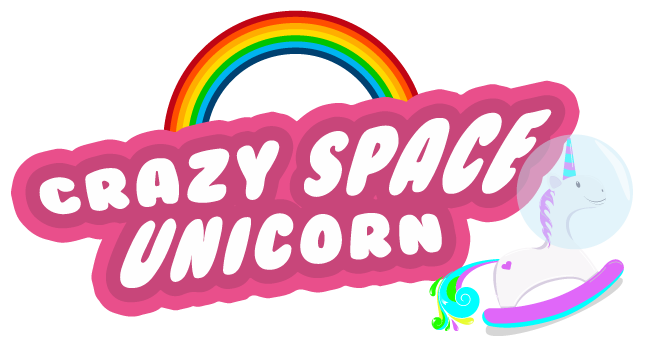

# Crazy Space Unicorn

**A game made with pure Javascript and some Html/Css during a GameJam**

**We use:**
- NodeJs
- PhaserJs

# Requirements:

**In order to play the game you need only need NodeJs installed on your machine:**

Check the [Official WebSite](https://nodejs.org/en/download/)

**Once you have installed nodeJs you can clone the project:**
You need git installed on your machine

    $ git clone git@github.com:Thibaut-gauvin/CrazySpaceUnicorn.git

**Now place into the project directory and Install dependency:**

    $ npm install
    $ ./node_modules/bower/bin/bower install

**Build the project and start the game with:**

    $ ./node_modules/gulp/bin/gulp.js build

Now you can play the game at [localhost:3000](http://localhost:3000)

[demo site](http://www.gauvin-thibaut.com:8080/)
